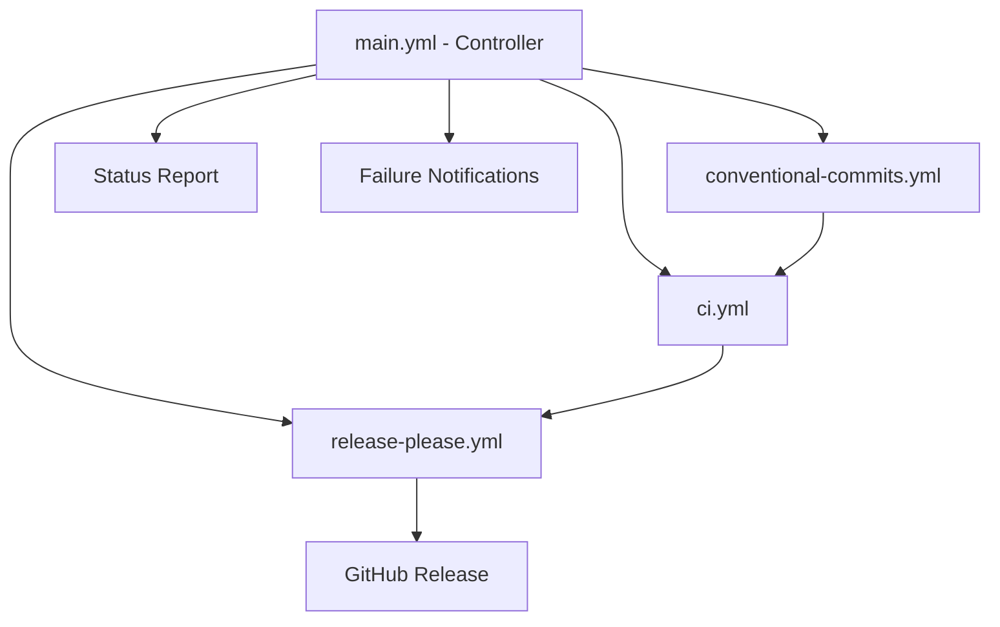

# GitHub Actions Workflow Architecture

This directory contains the comprehensive CI/CD pipeline for obsctl, designed around the principle of "duplication is the mother of fragility" with a single controlling workflow orchestrating all operations.

## 🏗️ Architecture Overview



## 📋 Workflow Files

### 🎯 main.yml - Master Controller
**Purpose**: Orchestrates all CI/CD operations with intelligent conditional logic
**Triggers**:
- Push to `main`, `master`, `develop` branches
- Pull requests to `main`, `master`, `develop` branches  
- Manual dispatch with options

**Key Features**:
- **Intelligent Routing**: Determines which workflows to run based on branch and event
- **Release Control**: Only runs releases on main/master pushes or manual dispatch
- **Emergency Options**: Skip tests for emergency releases
- **Status Reporting**: Comprehensive pipeline status with failure notifications
- **Issue Creation**: Automatically creates issues for failed releases

### 🔍 conventional-commits.yml - Commit Validation
**Purpose**: Validates conventional commit format and standards
**Triggers**: Called by main.yml controller
**Dependencies**: None (runs first)

### 🧪 ci.yml - Continuous Integration
**Purpose**: Comprehensive testing, linting, and quality assurance
**Triggers**: Called by main.yml controller
**Dependencies**: conventional-commits.yml must pass

**Features**:
- Pre-commit hooks validation
- Cross-platform compilation tests
- Cargo clippy linting
- Security audits
- Integration testing

### 🚀 release-please.yml - Release Pipeline
**Purpose**: Complete release automation with multi-platform builds
**Triggers**: Called by main.yml controller (main/master only)
**Dependencies**: conventional-commits.yml + ci.yml must pass

**Features**:
- Release-please automation
- Release configuration testing
- Multi-platform builds (6 architectures)
- Package creation (Debian, Chocolatey, Universal Binary)
- GitHub release creation

## 🔄 Execution Flow

### Pull Request Flow
```
PR Created/Updated → main.yml → conventional-commits.yml → ci.yml → Status Report
```

### Development Branch Flow
```
Push to develop → main.yml → conventional-commits.yml → ci.yml → Status Report
```

### Release Flow (main/master)
```
Push to main → main.yml → conventional-commits.yml → ci.yml → release-please.yml → Status Report
```

### Manual Release Flow
```
Manual Dispatch → main.yml → conventional-commits.yml → ci.yml → release-please.yml → Status Report
```

## 🎛️ Control Logic

### When CI Runs
- ✅ All pushes to any tracked branch
- ✅ All pull requests
- ✅ Manual dispatch (unless skip_tests=true)

### When Release Runs
- ✅ Push to main/master branch (after CI passes)
- ✅ Manual dispatch with force_release=true
- ❌ Pull requests
- ❌ Development branches
- ❌ CI failures

## 🚨 Failure Handling

### Automatic Issue Creation
When releases fail on main/master, the pipeline automatically creates GitHub issues with:
- Failure details and logs
- Commit information
- Next steps for resolution
- High-priority labels

### Status Reporting
Every pipeline run produces a comprehensive status report showing:
- Branch and event context
- Individual job results
- Overall pipeline status
- Failure reasons

## ⚡ Concurrency Control

### Automatic Cancellation Strategy
All workflows implement intelligent concurrency control to optimize resource usage:

- **Development Branches**: Previous builds are automatically cancelled when new pushes occur
- **Pull Requests**: Concurrent builds for the same PR are cancelled in favor of the latest
- **Main/Master**: Release builds are **NOT** cancelled to prevent incomplete releases
- **Manual Dispatch**: Can override concurrency for emergency situations

### Concurrency Groups
```yaml
# Standard workflows (CI, conventional-commits, main controller)
concurrency:
  group: ${{ github.workflow }}-${{ github.ref }}
  cancel-in-progress: true

# Release workflow (protected main/master)
concurrency:
  group: ${{ github.workflow }}-${{ github.ref }}
  cancel-in-progress: ${{ github.ref != 'refs/heads/main' && github.ref != 'refs/heads/master' }}
```

### Benefits
- **🚀 Faster feedback**: No waiting for outdated builds
- **💰 Cost optimization**: Reduces unnecessary compute usage
- **🔧 Developer experience**: Latest changes get priority
- **🛡️ Release safety**: Main/master builds complete fully

## 🔧 Manual Controls

### Emergency Release
```bash
# Force release on any branch (use with caution)
gh workflow run main.yml -f force_release=true
```

### Skip Tests
```bash
# Skip CI tests for emergency releases
gh workflow run main.yml -f skip_tests=true -f force_release=true
```

### Individual Workflow Testing
```bash
# Test individual workflows
gh workflow run conventional-commits.yml
gh workflow run ci.yml
gh workflow run release-please.yml
```

## 📊 Benefits

### Single Source of Truth
- All CI/CD logic centralized in main.yml
- No duplicate workflow definitions
- Consistent execution patterns

### Intelligent Execution
- Conditional logic prevents unnecessary runs
- Resource optimization
- Clear execution paths

### Comprehensive Reporting
- Full pipeline visibility
- Automatic failure notifications
- Status tracking

### Emergency Capabilities
- Manual override options
- Skip mechanisms for urgent fixes
- Flexible execution control

## 🛠️ Maintenance

### Adding New Workflows
1. Create workflow file with `workflow_call` trigger
2. Add call to main.yml controller
3. Update dependencies as needed
4. Test with manual dispatch

### Modifying Execution Logic
1. Update controller job in main.yml
2. Adjust conditional statements
3. Test with different branch scenarios
4. Update documentation

### Troubleshooting
1. Check main.yml controller logs first
2. Review individual workflow results
3. Check GitHub Issues for automatic failure reports
4. Use manual dispatch for testing

---

*This architecture follows the principle: "Duplication is the mother of fragility" - one controller, many specialized workers.* 