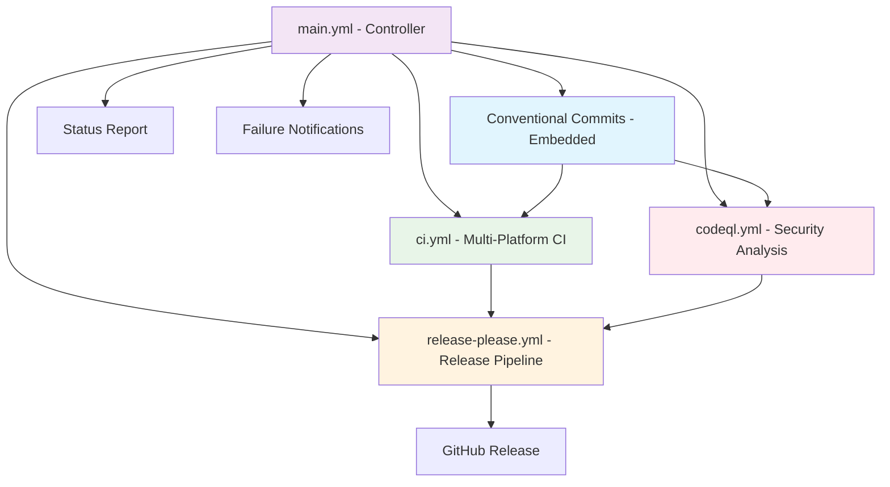

# GitHub Actions Workflow Architecture

This directory contains the comprehensive CI/CD pipeline for obsctl, designed around the principle of "duplication is the mother of fragility" with a single controlling workflow orchestrating all operations including integrated security analysis.

## 🚀 Development Workflow

### **Branch Protection Rules**
⚠️ **IMPORTANT**: Direct pushes to `main` and `master` branches are **BLOCKED** by repository branch protection rules. All changes must go through the pull request process.

### **Required Development Process**
1. **Create Feature Branch**: `git checkout -b issue-XXX-description`
2. **Make Changes**: Implement features, fixes, or improvements
3. **Commit with Pre-commit Hooks**: Quality gates run automatically
4. **Push Feature Branch**: `git push origin issue-XXX-description`
5. **Create Pull Request**: Triggers full CI/CD pipeline
6. **Code Review & Approval**: Required before merge
7. **Merge to Main**: Only possible through approved PR

### **Why This Matters**
- **Quality Assurance**: Every change goes through full validation
- **Code Review**: Peer review catches issues early
- **CI/CD Validation**: All quality gates must pass
- **Audit Trail**: Complete history of all changes
- **Branch Validation**: Issue-to-branch matching enforced

## 🏗️ Architecture Overview



## 📋 Workflow Files

### 🎯 main.yml - Master Controller
**Purpose**: Orchestrates all CI/CD operations with intelligent conditional logic
**Triggers**:
- Push to `main`, `master`, `develop` branches
- Pull requests to `main`, `master`, `develop` branches  
- Manual dispatch with options

**Key Features**:
- **Intelligent Routing**: Determines which workflows to run based on branch and event
- **Parallel Execution**: CI and Security analysis run simultaneously for efficiency
- **Release Control**: Only runs releases on PR merges to main/master or manual dispatch
- **Security Gates**: Security analysis must pass before releases
- **Emergency Options**: Skip tests for emergency releases
- **Status Reporting**: Comprehensive pipeline status with failure notifications
- **Issue Creation**: Automatically creates issues for failed releases or security vulnerabilities
- **Embedded Validation**: Includes conventional commits validation directly (no separate workflow)

### 🔍 Conventional Commits Validation - Embedded Job
**Purpose**: Validates conventional commit format and standards
**Location**: Embedded within main.yml workflow
**Dependencies**: None (runs first after controller)

### 🧪 ci.yml - Continuous Integration
**Purpose**: Comprehensive testing, linting, and quality assurance
**Triggers**: Called by main.yml controller
**Dependencies**: Conventional commits validation must pass

**Features**:
- **Multi-Platform Builds**: 9 target architectures (Linux/Windows/macOS × AMD64/ARM64/ARMv7)
- **Cross-Compilation**: Ubuntu runners for Linux + Windows, macOS runners for native builds
- **Quality Gates**: Pre-commit hooks, cargo clippy with automatic fixes, comprehensive testing
- **Performance Testing**: Integration tests with OTEL observability validation
- **Security Audits**: Cargo audit, dependency vulnerability scanning
- **Package Validation**: Debian, RPM, Chocolatey package creation tests

### 🔒 codeql.yml - Security Analysis
**Purpose**: Comprehensive security analysis and vulnerability detection
**Triggers**: Called by main.yml controller (runs in parallel with CI)
**Dependencies**: Conventional commits validation must pass

**Features**:
- **Multi-Language Analysis**: Rust, Python, JavaScript security scanning
- **CodeQL Integration**: GitHub's advanced semantic code analysis
- **Vulnerability Detection**: SAST (Static Application Security Testing)
- **Supply Chain Security**: Dependency vulnerability analysis
- **Scheduled Scanning**: Weekly automated security audits
- **SARIF Reporting**: Security findings uploaded to GitHub Security tab
- **Automatic Issue Creation**: Critical vulnerabilities trigger GitHub issues

### 🚀 release-please.yml - Release Pipeline
**Purpose**: Complete release automation with multi-platform builds
**Triggers**: Called by main.yml controller (PR merges to main/master only)
**Dependencies**: Conventional commits validation + ci.yml + codeql.yml must pass

**Features**:
- **Release-Please Automation**: Conventional commit-based versioning
- **Multi-Platform Distribution**: 9 architecture builds with optimized compilation
- **Package Creation**: Debian, RPM, Chocolatey, Homebrew, Universal Binary
- **Security Validation**: All packages scanned before distribution
- **GitHub Release Creation**: Automated release notes with security attestations
- **Artifact Management**: Comprehensive build artifact collection and signing

## 🔄 Execution Flow

### Pull Request Flow
```
PR Created/Updated → main.yml → [Conventional Commits] → ci.yml ∥ codeql.yml → Status Report
```

### Development Branch Flow
```
Push to develop → main.yml → [Conventional Commits] → ci.yml ∥ codeql.yml → Status Report
```

### Release Flow (PR Merge to main/master)
```
PR Merge to main → main.yml → [Conventional Commits] → ci.yml ∥ codeql.yml → release-please.yml → Status Report
```

### Direct Push Flow (main/master)
```
Direct Push to main → main.yml → [Conventional Commits] → ci.yml ∥ codeql.yml → Status Report (Release Skipped)
```

### Manual Release Flow
```
Manual Dispatch → main.yml → [Conventional Commits] → ci.yml ∥ codeql.yml → release-please.yml → Status Report
```

### Security-Only Flow (Scheduled)
```
Weekly Schedule → codeql.yml → Security Report → Issue Creation (if vulnerabilities found)
```

## 🎛️ Control Logic

### When CI Runs
- ✅ All pushes to any tracked branch
- ✅ All pull requests
- ✅ Manual dispatch (unless skip_tests=true)

### When Security Analysis Runs
- ✅ All pushes to any tracked branch (parallel with CI)
- ✅ All pull requests (parallel with CI)
- ✅ Weekly scheduled scans (Monday 6 AM UTC)
- ✅ Manual dispatch for security audits

### When Release Runs
- ✅ PR merge to main/master branch (after CI AND Security pass)
- ✅ Manual dispatch with force_release=true
- ❌ Direct pushes to main/master
- ❌ Pull requests
- ❌ Development branches
- ❌ CI failures
- ❌ Security vulnerabilities (Critical/High severity)

## 🔒 Security Integration

### Security Gates
- **Pre-Release Validation**: All security checks must pass before releases
- **Vulnerability Blocking**: Critical and High severity findings block releases
- **Supply Chain Security**: Dependency vulnerability scanning
- **SBOM Generation**: Software Bill of Materials for transparency
- **Security Attestations**: Signed security reports with releases

### Security Reporting
- **GitHub Security Tab**: All findings uploaded via SARIF
- **Automatic Issue Creation**: Critical vulnerabilities trigger GitHub issues
- **Weekly Security Reports**: Scheduled comprehensive security audits
- **Dependency Alerts**: Automated notifications for vulnerable dependencies

### Security Workflow Features
- **Multi-Language Support**: Rust, Python, JavaScript analysis
- **Incremental Analysis**: Only analyzes changed code in PRs
- **Baseline Security**: Maintains security baseline across releases
- **Security Metrics**: Tracks security posture over time

## 🚨 Failure Handling

### Automatic Issue Creation
When releases fail on main/master, the pipeline automatically creates GitHub issues with:
- Failure details and logs
- Commit information
- Next steps for resolution
- High-priority labels

### Security Issue Creation
When security vulnerabilities are found:
- **Critical/High**: Immediate GitHub issue creation with security labels
- **Medium/Low**: Weekly digest with recommendations
- **Supply Chain**: Dependency update PRs with security context
- **Compliance**: Security audit trail for enterprise requirements

### Status Reporting
Every pipeline run produces a comprehensive status report showing:
- Branch and event context
- Individual job results (CI, Security, Release)
- Overall pipeline status
- Security findings summary
- Failure reasons

## ⚡ Concurrency Control

### Automatic Cancellation Strategy
All workflows implement intelligent concurrency control to optimize resource usage:

- **Development Branches**: Previous builds are automatically cancelled when new pushes occur
- **Pull Requests**: Concurrent builds for the same PR are cancelled in favor of the latest
- **Main/Master**: Release builds are **NOT** cancelled to prevent incomplete releases
- **Security Analysis**: Scheduled scans use separate concurrency groups
- **Manual Dispatch**: Can override concurrency for emergency situations

### Concurrency Groups
```yaml
# Standard workflows (CI, conventional-commits, main controller)
concurrency:
  group: ${{ github.workflow }}-${{ github.ref }}
  cancel-in-progress: true

# Security workflow (scheduled vs triggered)
concurrency:
  group: ${{ github.event_name == 'workflow_dispatch' && format('{0}-{1}', github.workflow, github.ref) || format('{0}-scheduled', github.workflow) }}
  cancel-in-progress: ${{ github.event_name == 'workflow_dispatch' }}

# Release workflow (protected main/master)
concurrency:
  group: ${{ github.workflow }}-${{ github.ref }}
  cancel-in-progress: ${{ github.ref != 'refs/heads/main' && github.ref != 'refs/heads/master' }}
```

### Benefits
- **🚀 Faster feedback**: No waiting for outdated builds
- **💰 Cost optimization**: Reduces unnecessary compute usage
- **🔧 Developer experience**: Latest changes get priority
- **🛡️ Release safety**: Main/master builds complete fully
- **🔒 Security efficiency**: Parallel security analysis doesn't slow CI

## 🔧 Manual Controls

### Emergency Release
```bash
# Force release on any branch (use with caution)
gh workflow run main.yml -f force_release=true
```

### Skip Tests (Emergency Only)
```bash
# Skip CI tests for emergency releases (security still runs)
gh workflow run main.yml -f skip_tests=true -f force_release=true
```

### Security Analysis
```bash
# Manual security scan
gh workflow run codeql.yml
```

### Individual Workflow Testing
```bash
# Test individual workflows
gh workflow run main.yml      # Full pipeline including security
gh workflow run ci.yml        # CI only
gh workflow run codeql.yml    # Security only
gh workflow run release-please.yml  # Release only
```

## 📊 Benefits

### Single Source of Truth
- All CI/CD logic centralized in main.yml
- Conventional commits validation embedded (no separate workflow)
- Security analysis integrated into main pipeline
- No duplicate workflow definitions
- Consistent execution patterns

### Parallel Execution Efficiency
- CI and Security analysis run simultaneously
- Faster feedback cycles
- Optimized resource utilization
- No sequential bottlenecks

### Enterprise Security Posture
- Comprehensive security analysis (SAST, dependency scanning, supply chain)
- Security gates prevent vulnerable releases
- Automated vulnerability management
- Compliance-ready security reporting

### Intelligent Execution
- Conditional logic prevents unnecessary runs
- PR-only release control prevents accidental releases
- Resource optimization through smart concurrency
- Clear execution paths
- Security-aware release gating

### Comprehensive Reporting
- Full pipeline visibility including security status
- Automatic failure notifications
- Security vulnerability tracking
- Status tracking with security context
- Clear release skip messaging

### Emergency Capabilities
- Manual override options
- Skip mechanisms for urgent fixes (with security validation)
- Force release for emergency situations
- Flexible execution control
- Security-aware emergency procedures

## 🛠️ Maintenance

### Adding New Workflows
1. Create workflow file with `workflow_call` trigger
2. Add call to main.yml controller
3. Update dependencies as needed
4. Consider security implications
5. Test with manual dispatch

### Modifying Security Analysis
1. Update codeql.yml workflow
2. Adjust security gates in main.yml
3. Test with different vulnerability scenarios
4. Update security documentation

### Troubleshooting
1. Check main.yml controller logs first
2. Review individual workflow results (CI, Security, Release)
3. Check GitHub Security tab for security findings
4. Check GitHub Issues for automatic failure reports
5. Use manual dispatch for testing

### Security Maintenance
- **Weekly Reviews**: Check scheduled security scan results
- **Dependency Updates**: Monitor and approve security-related dependency updates
- **Baseline Updates**: Maintain security baseline as codebase evolves
- **Policy Updates**: Keep security policies current with threat landscape

---

*This architecture follows the principle: "Duplication is the mother of fragility" - one controller, many specialized workers, with security as a first-class citizen.* 