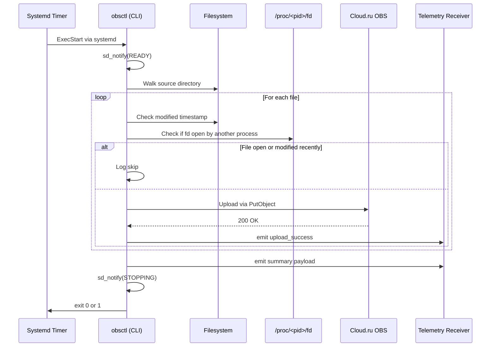

# upload\_obs

A robust, production-grade command-line tool that recursively uploads files from a local directory to an S3-compatible object storage (e.g., Cloud.ru OBS), while ensuring data integrity by skipping files that are still being written.

---

## 🔧 Why It Was Written

Typical `aws s3 sync` tools do not:

* Detect file descriptor collisions or write-in-progress conditions
* Integrate with systemd for service health signaling
* Emit OpenTelemetry (OTEL) traces for observability
* Provide complete retry logic and configurable concurrency

`obsctl` was designed specifically for mission-critical backup and archival scenarios (e.g., in regulated, industrial, or compliance-sensitive contexts).

---

## How It Works

1. Recursively traverses the source directory using `walkdir`
2. For each file:

    * Checks that it has **not been modified in the last 2 seconds**
    * Checks that **no process has it open for writing** via `/proc/<pid>/fd/`
3. If the file is stable, it uploads to the target bucket using AWS S3 API
4. Uses retry logic with exponential backoff on failure
5. Reports status via OTEL to a configurable telemetry endpoint
6. Notifies systemd of `READY` and `STOPPING` states

---

## Sequence Diagram



---

## Safety Guarantees

* Files still open for write **are never uploaded**
* Files modified within last 2 seconds are treated as unsafe
* Logs open FD owner PID for audit
* Fails fast if telemetry fails (but does not block uploads)

---

## Usage Example

```sh
obsctl \
  --source /sftp/export \
  --bucket my-backups \
  --prefix daily/ \
  --endpoint https://obs.ru-moscow-1.hc.sbercloud.ru \
  --region ru-moscow-1 \
  --http-timeout 15 \
  --max-concurrent 6 \
  --debug info
```

Set credentials via environment:

```sh
export AWS_ACCESS_KEY_ID="tenant:accesskey"
export AWS_SECRET_ACCESS_KEY="secret"
export OTEL_EXPORTER_OTLP_ENDPOINT="https://otel-receiver.example.com/v1/traces"
```

---

## 🧪 Tests

* Unit tests validate:

    * Key path formatting
    * CLI parsing
    * FD detection correctness
* Can be run with:

```sh
cargo test
```

---

## Features

* Parallel uploads with `--max-concurrent`
* OpenTelemetry span + summary export
* Rust async performance (via Tokio)
* Systemd integration
* Retry-safe

---


## 📄 License

MIT or Apache 2.0

