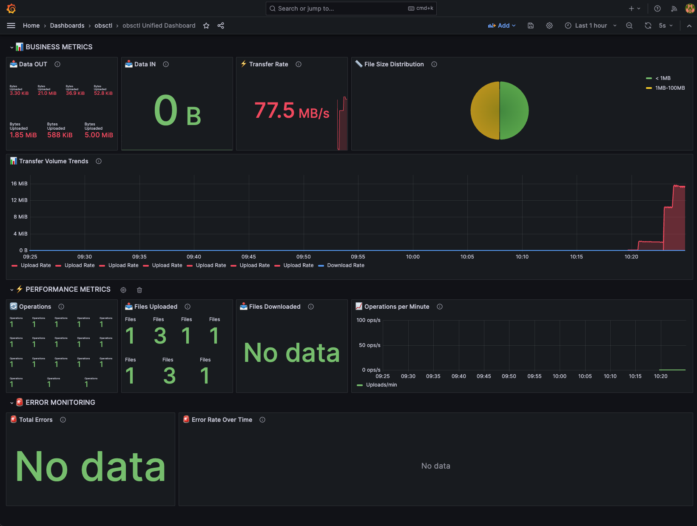
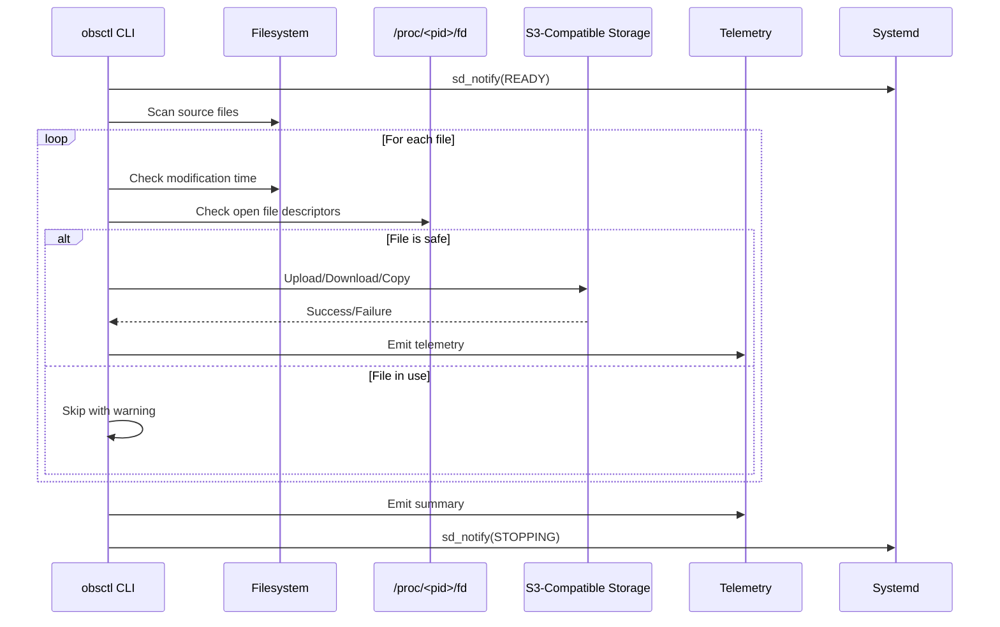

# obsctl - Object Storage Control Tool

A comprehensive, AWS CLI-compliant S3-compatible object storage management tool for **any S3-compatible service**. Originally designed to solve specific challenges with Cloud.ru OBS, obsctl now supports **MinIO, AWS S3, Ceph, DigitalOcean Spaces, Wasabi, Backblaze B2, and any S3-compatible storage** with advanced features not found in traditional tools.

Built with Rust for performance, safety, and reliability in production environments.

---

## 🔧 Why obsctl?

Traditional S3 tools don't provide:
* **Advanced wildcard patterns** - Bulk operations without complex scripting
* **Universal S3 compatibility** - Works with any S3-compatible storage
* **File safety checks** - Skip files being actively written
* **Production observability** - OTEL traces and metrics
* **Systemd integration** - Proper service lifecycle management
* **AWS CLI compatibility** - Familiar command structure
* **Robust error handling** - Comprehensive retry and recovery

`obsctl` was **originally designed to solve specific challenges with Cloud.ru OBS** but has evolved into a universal S3-compatible tool suitable for mission-critical backup, archival, and data management scenarios across any S3-compatible storage provider in regulated and industrial environments.

---



---

## 🚀 Features

**AWS CLI Compatible Commands:**
- `ls` - List objects in buckets with **wildcard pattern filtering** and **enterprise-grade advanced filtering** (equivalent to `aws s3 ls`)
- `cp` - Copy files/objects (equivalent to `aws s3 cp`)
- `sync` - Sync directories (equivalent to `aws s3 sync`)
- `rm` - Remove objects (equivalent to `aws s3 rm`)
- `mb` - Create buckets (equivalent to `aws s3 mb`)
- `rb` - Remove buckets with **pattern-based bulk deletion** (equivalent to `aws s3 rb`)
- `presign` - Generate presigned URLs (equivalent to `aws s3 presign`)
- `head-object` - Show object metadata (equivalent to `aws s3api head-object`)
- `du` - Storage usage statistics (custom extension)

**🎯 Enterprise-Grade Advanced Filtering:**
- **Date filtering** - Filter by creation/modification dates (YYYYMMDD + relative formats like 7d, 30d, 1y)
- **Size filtering** - Filter by file size with multi-unit support (B, KB, MB, GB, TB, PB)
- **Result management** - Head/tail operations with automatic sorting
- **Multi-level sorting** - Sort by multiple criteria (e.g., `modified:desc,size:asc,name:asc`)
- **Performance optimization** - Early termination for head operations, memory-efficient processing
- **Comprehensive validation** - Mutual exclusion handling, logical validation

**Production-Grade Safety:**
- Detects files still being written (via file descriptor checks)
- Skips recently modified files (2-second safety window)
- **Safety confirmations for pattern-based bulk operations**
- Systemd integration with health signaling
- OpenTelemetry (OTEL) observability
- Retry logic with exponential backoff
- Configurable concurrency limits

---
## 🌐 **Universal S3 Compatibility**

obsctl works seamlessly with **any S3-compatible object storage**:

| Provider | Status | Endpoint Example |
|----------|--------|------------------|
| **AWS S3** | ✅ Fully Supported | `s3.amazonaws.com` |
| **Cloud.ru OBS** | ✅ Fully Supported | `obs.ru-moscow-1.hc.sbercloud.ru` |
| **MinIO** | ✅ Fully Supported | `localhost:9000` |
| **Ceph RadosGW** | ✅ Fully Supported | `ceph.example.com` |
| **DigitalOcean Spaces** | ✅ Fully Supported | `nyc3.digitaloceanspaces.com` |
| **Wasabi** | ✅ Fully Supported | `s3.wasabisys.com` |
| **Backblaze B2** | ✅ Fully Supported | `s3.us-west-000.backblazeb2.com` |
| **Any S3 API** | ✅ Fully Supported | Custom endpoints |

---

## 🏗️ Architecture



---

## 🛡️ Safety Guarantees

| Safety Feature | Description |
|---------------|-------------|
| **Open File Detection** | Skips files with active file descriptors via `/proc/<pid>/fd` |
| **Modification Window** | Ignores files modified within 2 seconds |
| **Atomic Operations** | Uses S3 multipart uploads for large files |
| **Retry Logic** | Exponential backoff with configurable limits |
| **Dry Run Mode** | Test operations without making changes |

---

## Processor Architecture Matrix

### Supported Architectures
| Architecture | Target Triple | Platform Support | Use Cases |
|--------------|---------------|------------------|-----------|
| **x86_64** | x86_64-unknown-linux-gnu | Linux, Windows | Servers, Desktops |
| **ARM64** | aarch64-unknown-linux-gnu | Linux, macOS | Apple Silicon, ARM servers |
| **ARMv7** | armv7-unknown-linux-gnueabihf | Linux | Raspberry Pi, IoT devices |
| **macOS Intel** | x86_64-apple-darwin | macOS | Intel Macs |
| **macOS ARM** | aarch64-apple-darwin | macOS | Apple Silicon Macs |
| **Windows x64** | x86_64-pc-windows-msvc | Windows | Windows desktops/servers |

---

### **Multi-Provider Usage Examples**

```bash
# AWS S3
obsctl cp ./data s3://bucket/data --region us-east-1

# Cloud.ru OBS (original use case)
obsctl cp ./data s3://bucket/data \
  --endpoint https://obs.ru-moscow-1.hc.sbercloud.ru \
  --region ru-moscow-1

# MinIO (development/testing)
obsctl cp ./data s3://bucket/data \
  --endpoint http://localhost:9000 \
  --region us-east-1

# DigitalOcean Spaces
obsctl cp ./data s3://bucket/data \
  --endpoint https://nyc3.digitaloceanspaces.com \
  --region nyc3

# Wasabi
obsctl cp ./data s3://bucket/data \
  --endpoint https://s3.wasabisys.com \
  --region us-east-1
```

---

## 🎯 **Unique Differentiator: Advanced Pattern Matching with Auto-Detection**

Unlike basic S3 tools, `obsctl` provides **intelligent pattern matching with automatic regex detection** for bucket operations - a feature that dramatically simplifies bulk operations and makes obsctl much more efficient than traditional tools **across any S3-compatible storage**.

### **Intelligent Auto-Detection System**

obsctl automatically detects whether your pattern is a simple wildcard or advanced regex, giving you the power of both worlds:

- **Simple patterns** → Wildcard matching (user-friendly)
- **Complex patterns** → Full regex power (advanced users)
- **No flags needed** → Auto-detection handles everything

### **Pattern-Based Bucket Management**

```bash
# Simple wildcard patterns (auto-detected)
obsctl ls --pattern "*-prod"                   # Production buckets
obsctl ls --pattern "user-?-bucket"           # Single-digit user buckets
obsctl ls --pattern "logs-202[0-9]"           # Year-based logs

# Advanced regex patterns (auto-detected)
obsctl ls --pattern "^backup-\d{4}-\d{2}$"    # Date-formatted backups
obsctl ls --pattern "(dev|test|staging)-.*"   # Multi-environment matching
obsctl ls --pattern "user-\d+-data$"          # Numeric user data buckets

# Complex real-world scenarios
obsctl rb --pattern "^temp-session-[a-f0-9]{8}$" --confirm  # Session cleanup
obsctl ls --pattern "logs-\d{4}-(0[1-9]|1[0-2])"          # Monthly logs
```

### **Comprehensive Pattern Reference**

#### **Wildcard Patterns (Simple & Familiar)**
| Pattern | Description | Example | Matches |
|---------|-------------|---------|---------|
| `*` | Any sequence of characters | `app-*` | `app-prod`, `app-staging`, `app-dev` |
| `?` | Single character | `user-?` | `user-1`, `user-a`, `user-x` |
| `[abc]` | Character set | `env-[dps]*` | `env-dev`, `env-prod`, `env-staging` |
| `[a-z]` | Character range | `backup-[0-9]` | `backup-1`, `backup-5`, `backup-9` |
| `[!abc]` | Negated set | `*-[!t]*` | Excludes test environments |

#### **Regex Patterns (Advanced & Powerful)**
| Pattern | Description | Example | Matches |
|---------|-------------|---------|---------|
| `^pattern$` | Exact match | `^app-prod$` | Only `app-prod` |
| `\d+` | One or more digits | `backup-\d+` | `backup-123`, `backup-2024` |
| `\w{3,8}` | 3-8 word characters | `^\w{3,8}$` | `app`, `bucket`, `data123` |
| `(a\|b\|c)` | Alternation | `(dev\|test\|prod)-.*` | `dev-app`, `test-bucket`, `prod-data` |
| `.*` | Any characters (regex) | `.*-backup-.*` | `app-backup-2024`, `user-backup-old` |
| `\d{4}-\d{2}` | Date patterns | `logs-\d{4}-\d{2}` | `logs-2024-01`, `logs-2023-12` |
| `[a-f0-9]{8}` | Hex patterns | `session-[a-f0-9]{8}` | `session-abc12345`, `session-def67890` |
| `^(?!test).*` | Negative lookahead | `^(?!test).*-prod$` | `app-prod` but not `test-prod` |

> 💡 **Pro Tip**: Need help building complex regex patterns? Use [**Rubular.com**](https://rubular.com/) - an interactive regex editor where you can test your patterns against sample text in real-time. Perfect for validating bucket naming patterns before running obsctl commands!

### **Real-World Examples by Use Case**

#### **Production Environment Management**
```bash
# Production buckets only
obsctl ls --pattern ".*-prod$"

# Non-production environments  
obsctl ls --pattern ".*(dev|test|staging).*"

# Versioned releases
obsctl ls --pattern "^app-v\d+\.\d+\.\d+-prod$"
```

#### **Date-Based Operations**
```bash
# Monthly backups (2024)
obsctl ls --pattern "^backup-2024-(0[1-9]|1[0-2])$"

# Daily logs (January 2024)
obsctl ls --pattern "^logs-2024-01-([0-2][0-9]|3[01])$"

# Quarterly reports
obsctl ls --pattern "^reports-\d{4}-Q[1-4]$"
```

#### **User and Session Management**
```bash
# Numeric user IDs only
obsctl ls --pattern "^user-\d+-.*"

# Temporary session buckets
obsctl rb --pattern "^temp-session-[a-f0-9]{8,16}$" --confirm

# User buckets with specific patterns
obsctl ls --pattern "^user-[a-z]{3,10}-workspace$"
```

#### **Cleanup and Maintenance**
```bash
# All test and temporary buckets
obsctl rb --pattern "^(test|tmp|temp)-.*" --confirm

# Old backup buckets (before 2023)
obsctl rb --pattern "^backup-20(1[0-9]|2[0-2])-.*" --confirm

# Development branches
obsctl rb --pattern "^dev-feature-.*" --confirm
```

#### **Complex Business Logic**
```bash
# Multi-region production buckets
obsctl ls --pattern "^(us|eu|ap)-(east|west|central)-\d+-prod$"

# Compliance-specific patterns
obsctl ls --pattern "^(audit|compliance|security)-\d{4}-(q[1-4]|annual)$"

# Service-specific buckets
obsctl ls --pattern "^(api|web|mobile|backend)-.*-(prod|staging)$"
```

### **Auto-Detection Examples**

```bash
# These are automatically detected as WILDCARD patterns:
obsctl ls --pattern "*-prod"           # Simple wildcard
obsctl ls --pattern "user-?"           # Single character wildcard
obsctl ls --pattern "[abc]*"           # Character class wildcard

# These are automatically detected as REGEX patterns:
obsctl ls --pattern "^backup-\d+$"     # Contains ^ and \d
obsctl ls --pattern "(dev|test|prod)"  # Contains parentheses and |
obsctl ls --pattern "bucket{3,8}"      # Contains curly braces
obsctl ls --pattern "app\w+"           # Contains backslash escape
```

> 🔧 **Regex Testing**: For complex regex patterns, test them first at [**Rubular.com**](https://rubular.com/) with sample bucket names to ensure they match exactly what you expect before running production commands.

**This intelligent pattern functionality eliminates the need for complex shell scripting with `grep`, `awk`, or multiple API calls** - operations that would require dozens of lines of bash can be done with a single obsctl command **regardless of your S3 provider**.


---

## 📖 Quick Start

### Installation

```bash
# Build from source
cargo build --release
sudo cp target/release/obsctl /usr/local/bin/

# Set credentials (works with any S3 provider)
export AWS_ACCESS_KEY_ID="your-access-key"
export AWS_SECRET_ACCESS_KEY="your-secret-key"
```

### Basic Usage

```bash
# List bucket contents (any S3 provider)
obsctl ls s3://my-bucket/

# List buckets with patterns
obsctl ls --pattern "*-prod"                    # Production buckets
obsctl ls --pattern "user-[0-9]-*"             # Numbered user buckets
obsctl ls --pattern "logs-202[3-4]"            # Recent log buckets

# Upload a file
obsctl cp ./local-file.txt s3://my-bucket/remote-file.txt

# Download a file
obsctl cp s3://my-bucket/remote-file.txt ./local-file.txt

# Sync directories
obsctl sync ./local-dir s3://my-bucket/remote-dir/ --delete

# Remove objects
obsctl rm s3://my-bucket/old-file.txt

# Create/remove buckets
obsctl mb s3://new-bucket
obsctl rb s3://empty-bucket --force

# Pattern-based bucket deletion (with safety confirmation)
obsctl rb --pattern "test-*" --confirm         # Delete all test buckets
obsctl rb --pattern "temp-[0-9]*" --confirm    # Delete numbered temp buckets

# Generate presigned URLs
obsctl presign s3://my-bucket/file.txt --expires-in 3600

# Check storage usage
obsctl du s3://my-bucket/ --human-readable
```

### 🎯 **Enterprise-Grade Advanced Filtering**

obsctl provides database-quality filtering capabilities for S3 object operations, enabling sophisticated data lifecycle management, operational monitoring, and cost optimization.

#### **Date Filtering**
```bash
# Objects created after specific date (YYYYMMDD format)
obsctl ls s3://logs/ --created-after 20240101 --recursive

# Objects modified in the last 7 days (relative format)
obsctl ls s3://data/ --modified-after 7d --recursive

# Date range filtering
obsctl ls s3://backups/ --created-after 20240101 --created-before 20240131 --recursive

# Recent activity monitoring
obsctl ls s3://user-data/ --modified-after 1d --sort-by modified:desc --head 50
```

#### **Size Filtering**
```bash
# Large files consuming storage (default unit: MB)
obsctl ls s3://uploads/ --min-size 100 --recursive --sort-by size:desc

# Small files for cleanup (explicit units)
obsctl ls s3://cache/ --max-size 1KB --recursive --sort-by size:asc

# Size range filtering
obsctl ls s3://media/ --min-size 10MB --max-size 1GB --recursive

# Storage optimization analysis
obsctl ls s3://archive/ --max-size 1MB --created-before 20230101 --max-results 1000
```

#### **Multi-Level Sorting**
```bash
# Primary: modification date (desc), Secondary: size (asc)
obsctl ls s3://logs/ --sort-by modified:desc,size:asc --recursive

# Complex sorting: date, size, then name
obsctl ls s3://data/ --sort-by created:desc,size:desc,name:asc --recursive

# Simple reverse sorting
obsctl ls s3://files/ --sort-by size --reverse --recursive
```

#### **Head/Tail Operations**
```bash
# Most recent 20 files (auto-sorted by modification date)
obsctl ls s3://activity/ --tail 20 --recursive

# First 100 results after filtering
obsctl ls s3://bucket/ --min-size 10MB --head 100 --recursive

# Largest 50 files
obsctl ls s3://storage/ --sort-by size:desc --head 50 --recursive

# Latest 10 log files
obsctl ls s3://logs/ --pattern "*.log" --tail 10 --recursive
```

#### **Combined Advanced Filtering**
```bash
# Data lifecycle management: Find old large files for archival
obsctl ls s3://production-data/ --recursive \
  --modified-before 20230101 \
  --min-size 100MB \
  --sort-by modified:asc,size:desc \
  --max-results 1000

# Security audit: Recently modified sensitive files
obsctl ls s3://sensitive-data/ --recursive \
  --modified-after 1d \
  --pattern "*confidential*" \
  --sort-by modified:desc \
  --head 100

# Cost optimization: Small old files analysis
obsctl ls s3://user-uploads/ --recursive \
  --created-before 20231201 \
  --max-size 1MB \
  --sort-by size:asc,created:asc \
  --max-results 5000

# Operational monitoring: Recent large uploads
obsctl ls s3://uploads/ --recursive \
  --created-after 7d \
  --min-size 50MB \
  --sort-by created:desc,size:desc \
  --head 20

# Performance analysis: Files by modification pattern
obsctl ls s3://app-data/ --recursive \
  --modified-after 30d \
  --pattern "*.db" \
  --sort-by modified:desc,size:desc \
  --tail 50
```

#### **Enterprise Use Cases**

**Data Lifecycle Management:**
```bash
# Compliance: Files older than 7 years for deletion
obsctl ls s3://compliance-data/ --recursive \
  --created-before 20170101 \
  --sort-by created:asc \
  --max-results 10000

# Archive candidates: Large old files
obsctl ls s3://active-storage/ --recursive \
  --modified-before 20231201 \
  --min-size 1GB \
  --sort-by size:desc,modified:asc
```

**Security & Auditing:**
```bash
# Incident response: Recently modified files
obsctl ls s3://secure-vault/ --recursive \
  --modified-after 1d \
  --sort-by modified:desc \
  --max-results 500

# Access pattern analysis: Large recent downloads
obsctl ls s3://download-logs/ --recursive \
  --created-after 7d \
  --min-size 10MB \
  --sort-by created:desc,size:desc
```

**Cost Optimization:**
```bash
# Storage analysis: Small files consuming space
obsctl ls s3://user-data/ --recursive \
  --max-size 100KB \
  --sort-by size:asc \
  --max-results 10000

# Duplicate analysis: Files of same size
obsctl ls s3://media-library/ --recursive \
  --sort-by size:desc,name:asc \
  --max-results 5000
```

**Performance Monitoring:**
```bash
# Hot data identification: Recently accessed large files
obsctl ls s3://cache-storage/ --recursive \
  --modified-after 1d \
  --min-size 50MB \
  --sort-by modified:desc,size:desc \
  --head 100
```

#### **Advanced Filtering Options Reference**

| Flag | Description | Format | Example |
|------|-------------|--------|---------|
| `--created-after` | Filter by creation date (after) | YYYYMMDD or relative | `20240101`, `7d`, `30d`, `1y` |
| `--created-before` | Filter by creation date (before) | YYYYMMDD or relative | `20241231`, `30d` |
| `--modified-after` | Filter by modification date (after) | YYYYMMDD or relative | `20240601`, `1d`, `7d` |
| `--modified-before` | Filter by modification date (before) | YYYYMMDD or relative | `20240630`, `1d` |
| `--min-size` | Minimum file size | Number + unit | `100MB`, `1GB`, `500KB` |
| `--max-size` | Maximum file size | Number + unit | `1GB`, `100MB`, `10KB` |
| `--max-results` | Limit total results | Number | `1000`, `5000`, `10000` |
| `--head` | First N results | Number | `50`, `100`, `500` |
| `--tail` | Last N results (auto-sorted) | Number | `20`, `50`, `100` |
| `--sort-by` | Multi-level sorting | field:dir,field:dir | `modified:desc,size:asc` |
| `--reverse` | Simple reverse sort | Flag | Use with single sort field |

**Supported Units:** B, KB, MB, GB, TB, PB (decimal) and KiB, MiB, GiB, TiB, PiB (binary)  
**Sort Fields:** name, size, created, modified  
**Sort Directions:** asc (ascending), desc (descending)

#### **Performance Features**
- **Early termination** for head operations (stops processing when limit reached)
- **Memory-efficient** streaming for large buckets (>100K objects)
- **Intelligent sorting** with automatic optimization
- **Result limiting** to prevent memory exhaustion
- **Auto-sorting** for tail operations (by modification date)

### Provider-Specific Examples

```bash
# AWS S3 (default behavior)
obsctl cp ./data/ s3://aws-bucket/data/ --recursive

# Cloud.ru OBS (original use case)
obsctl cp ./data/ s3://backups/daily/ \
  --endpoint https://obs.ru-moscow-1.hc.sbercloud.ru \
  --region ru-moscow-1 \
  --recursive \
  --max-concurrent 8

# MinIO (development/testing)
obsctl cp ./data/ s3://minio-bucket/data/ \
  --endpoint http://localhost:9000 \
  --region us-east-1 \
  --recursive

# DigitalOcean Spaces
obsctl cp ./data/ s3://do-space/data/ \
  --endpoint https://nyc3.digitaloceanspaces.com \
  --region nyc3 \
  --recursive

# Wasabi
obsctl cp ./data/ s3://wasabi-bucket/data/ \
  --endpoint https://s3.wasabisys.com \
  --region us-east-1 \
  --recursive
```

### Advanced Pattern Examples

```bash
# Simple wildcard patterns (auto-detected)
obsctl ls --pattern "app-*-[0-9][0-9]"         # Versioned app buckets (app-prod-01, app-staging-15)
obsctl ls --pattern "*-[ds]*"                  # Dev and staging environments  
obsctl ls --pattern "backup-202[0-9]-[01][0-9]" # Monthly backups by year and month

# Advanced regex patterns (auto-detected)
obsctl ls --pattern "^app-v\d+\.\d+\.\d+$"     # Semantic versioning (app-v1.2.3)
obsctl ls --pattern "^logs-\d{4}-(0[1-9]|1[0-2])-(0[1-9]|[12][0-9]|3[01])$" # Daily logs
obsctl ls --pattern "^(frontend|backend|api)-.*-(prod|staging)$" # Service-environment pattern

# Complex business scenarios  
obsctl ls --pattern "^user-\d{6,10}-workspace$" # Employee ID workspaces
obsctl ls --pattern "^backup-\d{4}-q[1-4]-final$" # Quarterly backup finalization
obsctl ls --pattern "^temp-[a-f0-9]{8}-session$" # Temporary session storage

# Bulk cleanup operations (with safety confirmations)
obsctl rb --pattern "^tmp-.*" --confirm        # Clean up all temporary buckets
obsctl rb --pattern "^test-.*-\d{8}$" --confirm # Remove dated test buckets  
obsctl rb --pattern "^dev-feature-.*" --confirm # Remove feature branch buckets
obsctl rb --pattern "^(staging|dev)-.*-old$" --confirm # Remove old non-prod buckets
```

### Advanced Options

```bash
# Sync with pattern filtering (any S3 provider)
obsctl sync ./logs s3://log-bucket/app-logs/ \
  --include "*.log" \
  --exclude "*.tmp" \
  --delete \
  --dryrun
```

---

## 📊 Observability

### OpenTelemetry Integration

```bash
export OTEL_EXPORTER_OTLP_ENDPOINT="https://otel-receiver.example.com/v1/traces"

# Operations automatically emit traces (any S3 provider)
obsctl cp ./data s3://bucket/data --recursive
```

### Systemd Health Monitoring

```bash
# Check service status
systemctl status obsctl.service

# View logs
journalctl -u obsctl.service --since "1 hour ago"
```

---

## 🔧 Configuration

### Environment Variables

```bash
# AWS Credentials (works with any S3-compatible provider)
export AWS_ACCESS_KEY_ID="your-access-key"
export AWS_SECRET_ACCESS_KEY="your-secret-key"

# Provider-specific endpoints
export AWS_ENDPOINT_URL="https://your-s3-provider.com"

# Observability
export OTEL_EXPORTER_OTLP_ENDPOINT="https://otel.example.com/otlp"

# Logging
export AWS_LOG_LEVEL="debug"
export AWS_SMITHY_LOG="debug"
```

### Global Options

```bash
obsctl [GLOBAL_OPTIONS] <COMMAND> [COMMAND_OPTIONS]

Global Options:
  --debug <LEVEL>         Log level: trace, debug, info, warn, error [default: info]
  -e, --endpoint <URL>    Custom S3 endpoint URL (for any S3-compatible provider)
  -r, --region <REGION>   AWS region [default: us-east-1]
  --timeout <SECONDS>     HTTP timeout [default: 10]
```

---

## 🧪 Testing

```bash
# Run all tests
cargo test

# Run with coverage
cargo test --coverage

# Test specific functionality
cargo test s3_uri
```

Test coverage includes:
- S3 URI parsing and validation
- Command-line argument parsing
- File descriptor detection
- Error handling scenarios
- Multi-provider compatibility

---

## 📚 Documentation

- [Operator Manual](docs/MANUAL.md) - Production deployment guide
- [GitLab CI Integration](docs/GITLAB_CI.md) - CI/CD pipeline setup

---

## 🤝 Contributing

1. Fork the repository
2. Create a feature branch: `git checkout -b feature/new-command`
3. Make changes following AWS CLI conventions
4. Add tests for new functionality
5. Submit a pull request

---

## 📄 License

MIT or Apache 2.0

---

## 🏷️ Version History

- **v0.4.0** - **🚀 MAJOR: Intelligent Pattern Matching with Auto-Detection** - Automatic wildcard/regex detection, comprehensive regex support with [Rubular](https://rubular.com/)-style patterns, real-world business logic examples, enhanced Universal S3 compatibility documentation
- **v0.3.0** - **Advanced wildcard pattern support** for bucket operations, OpenTelemetry built-in by default, **Universal S3 compatibility**
- **v0.2.0** - AWS CLI compliant command structure, comprehensive S3 operations
- **v0.1.0** - Initial upload-only tool with safety features for Cloud.ru OBS

