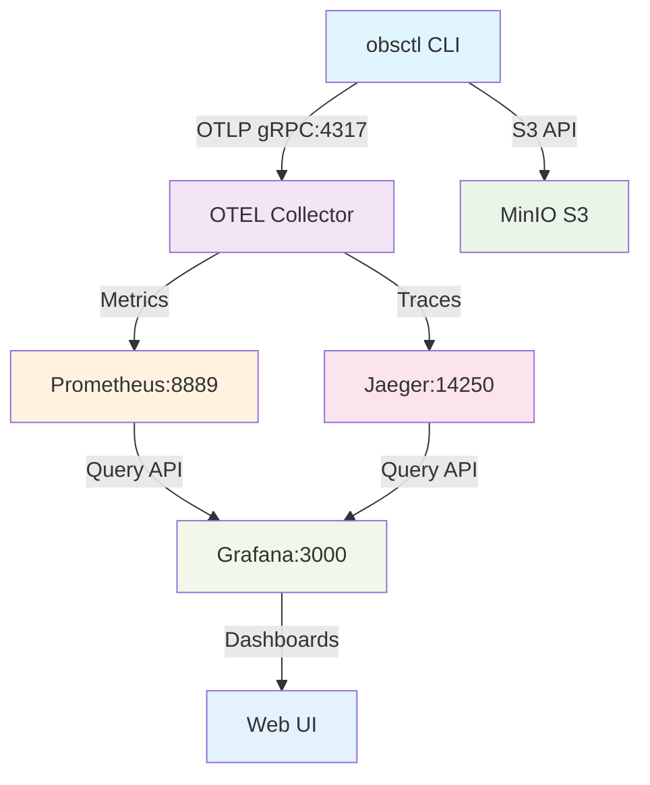
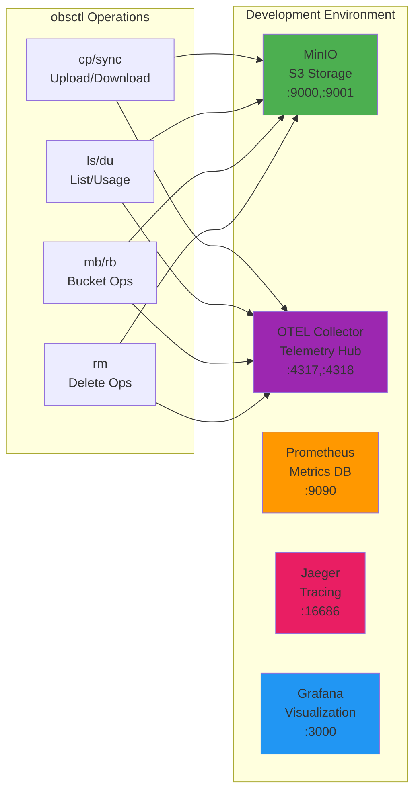

# ADR-0010: Docker Compose Development Architecture

## Status
**Accepted** - Implemented (July 2025)

## Context

obsctl development required a comprehensive local development environment supporting S3-compatible storage, observability infrastructure, and testing capabilities. Manual service management was error-prone and inconsistent across development teams.

## Decision

Implement unified Docker Compose architecture providing complete development infrastructure with environment variable overrides for CI deployment.

### Core Strategy
- **Single docker-compose.yml** - Unified development environment
- **Environment Variable Overrides** - CI-specific configurations
- **Complete Observability Stack** - Full OTEL pipeline in containers
- **S3-Compatible Storage** - MinIO for local development

## Infrastructure Architecture

### Data Flow Diagram


### Service Architecture


## Docker Compose Configuration

### Core Services Definition
```yaml
services:
  minio:
    image: minio/minio:latest
    command: server /data --console-address ":9001"
    ports:
      - "9000:9000"
      - "9001:9001"
    environment:
      MINIO_ACCESS_KEY: ${MINIO_ACCESS_KEY:-minioadmin}
      MINIO_SECRET_KEY: ${MINIO_SECRET_KEY:-minioadmin}
    deploy:
      resources:
        limits:
          memory: ${MINIO_MEM_LIMIT:-8g}
          cpus: '2'
    restart: ${RESTART_POLICY:-unless-stopped}
    volumes:
      - minio_data:/data
    healthcheck:
      test: ["CMD", "curl", "-f", "http://localhost:9000/minio/health/live"]
      interval: 30s
      timeout: 10s
      retries: 3
```

### OTEL Collector Configuration
```yaml
  otel-collector:
    image: otel/opentelemetry-collector-contrib:0.93.0
    command: ["--config=/etc/otel-collector-config.yaml"]
    volumes:
      - ./otel-collector-config.yaml:/etc/otel-collector-config.yaml
    ports:
      - "4317:4317"   # OTLP gRPC receiver
      - "4318:4318"   # OTLP HTTP receiver
      - "8889:8889"   # Prometheus metrics endpoint
    depends_on:
      - prometheus
      - jaeger
    restart: ${RESTART_POLICY:-unless-stopped}
```

### Observability Stack
```yaml
  prometheus:
    image: prom/prometheus:latest
    ports:
      - "9090:9090"
    volumes:
      - prometheus_data:/prometheus
    restart: ${RESTART_POLICY:-unless-stopped}

  jaeger:
    image: jaegertracing/all-in-one:latest
    ports:
      - "16686:16686"  # Jaeger UI
      - "14250:14250"  # gRPC collector
    environment:
      COLLECTOR_OTLP_ENABLED: true
    restart: ${RESTART_POLICY:-unless-stopped}

  grafana:
    image: grafana/grafana:latest
    ports:
      - "3000:3000"
    environment:
      GF_SECURITY_ADMIN_PASSWORD: ${GRAFANA_PASSWORD:-admin}
    volumes:
      - grafana_data:/var/lib/grafana
      - ./packaging/dashboards:/etc/grafana/provisioning/dashboards
    restart: ${RESTART_POLICY:-unless-stopped}
```

## Environment Variable Strategy

### Development Defaults
```yaml
# Default values for development
MINIO_MEM_LIMIT: 8g
RESTART_POLICY: unless-stopped
GRAFANA_PASSWORD: admin
PROMETHEUS_RETENTION: 15d
JAEGER_RETENTION: 24h
```

### CI Overrides (docker-compose.ci.env)
```yaml
# CI-specific resource constraints
MINIO_MEM_LIMIT: 512m
RESTART_POLICY: "no"
GRAFANA_PASSWORD: ci-password
PROMETHEUS_RETENTION: 1h
JAEGER_RETENTION: 30m
```

### CI Deployment Command
```bash
# GitHub Actions CI deployment
docker compose --env-file docker-compose.ci.env up -d minio otel-collector
```

## OTEL Collector Pipeline

### Receiver Configuration
```yaml
receivers:
  otlp:
    protocols:
      grpc:
        endpoint: 0.0.0.0:4317
      http:
        endpoint: 0.0.0.0:4318
```

### Processor Configuration
```yaml
processors:
  batch:
    timeout: 1s
    send_batch_size: 1024
  memory_limiter:
    limit_mib: 256
```

### Exporter Configuration
```yaml
exporters:
  prometheus:
    endpoint: "0.0.0.0:8889"
    namespace: obsctl
    const_labels:
      service: obsctl
  jaeger:
    endpoint: jaeger:14250
    tls:
      insecure: true
```

## Data Flow Architecture

### Metrics Pipeline
```
obsctl → OTEL Collector (gRPC:4317) → Prometheus (HTTP:8889) → Grafana (Query API)
```

### Traces Pipeline  
```
obsctl → OTEL Collector (gRPC:4317) → Jaeger (gRPC:14250) → Jaeger UI (HTTP:16686)
```

### S3 Operations Pipeline
```
obsctl → MinIO (S3 API:9000) → MinIO Console (HTTP:9001)
```

### Dashboard Pipeline
```
Prometheus + Jaeger → Grafana (HTTP:3000) → obsctl-unified.json → Web UI
```

## Development Workflow

### Environment Startup
```bash
# Start complete development environment
docker compose up -d

# Verify all services healthy
docker compose ps

# View logs for troubleshooting
docker compose logs -f otel-collector
```

### Service Access Points
- **MinIO Console** - http://localhost:9001 (admin/minioadmin)
- **Grafana Dashboards** - http://localhost:3000 (admin/admin)
- **Prometheus Metrics** - http://localhost:9090
- **Jaeger Traces** - http://localhost:16686
- **OTEL Metrics** - http://localhost:8889/metrics

### Testing Integration
```bash
# Test obsctl with full observability
export AWS_ENDPOINT_URL=http://localhost:9000
export AWS_ACCESS_KEY_ID=minioadmin
export AWS_SECRET_ACCESS_KEY=minioadmin
export OTEL_EXPORTER_OTLP_ENDPOINT=http://localhost:4317

obsctl cp test.txt s3://test-bucket/
```

## Volume Management

### Persistent Volumes
```yaml
volumes:
  minio_data:
    driver: local
  prometheus_data:
    driver: local
  grafana_data:
    driver: local
```

### Data Persistence Strategy
- **Development** - Named volumes for data persistence
- **CI** - Ephemeral volumes for clean testing
- **Production** - External volumes with backup strategies

## Alternatives Considered

1. **Separate docker-compose Files** - Rejected due to duplication
2. **Manual Service Management** - Rejected due to complexity
3. **Cloud-Only Development** - Rejected due to cost and latency
4. **Kubernetes Development** - Rejected due to overhead
5. **Individual Container Commands** - Rejected due to coordination complexity

## Consequences

### Positive
- **Single Source of Truth** - One docker-compose.yml for all environments
- **Environment Flexibility** - Easy CI/development configuration
- **Complete Observability** - Full OTEL pipeline in development
- **Consistent Development** - Same infrastructure for all developers
- **Easy Onboarding** - Single command environment setup
- **Cost Effective** - Local development reduces cloud costs

### Negative
- **Resource Requirements** - Multiple containers require significant RAM/CPU
- **Complexity** - Multiple interconnected services
- **Docker Dependency** - Requires Docker infrastructure
- **Network Configuration** - Port management and conflicts
- **Storage Usage** - Persistent volumes consume disk space

## Performance Characteristics

### Resource Usage
- **Memory** - 2-4GB RAM for complete stack
- **CPU** - 2-4 cores for optimal performance
- **Disk** - 1-2GB for persistent volumes
- **Network** - Internal container networking

### Startup Performance
- **Cold Start** - 60-90 seconds for complete stack
- **Warm Start** - 15-30 seconds with cached images
- **Health Checks** - 30 seconds for all services healthy
- **Ready State** - <2 minutes from docker compose up

## Validation Results

### Success Criteria Met
- ✅ Single docker-compose.yml supports dev and CI
- ✅ All services start reliably and pass health checks
- ✅ Complete OTEL pipeline functional end-to-end
- ✅ MinIO S3 compatibility working with obsctl
- ✅ Environment variable overrides working in CI
- ✅ Grafana dashboards auto-provisioned
- ✅ Data persistence working across restarts

### Integration Testing
- **Full Stack Testing** - All services tested together
- **CI/CD Integration** - GitHub Actions using CI configuration
- **Performance Testing** - Load testing with traffic generator
- **Failure Recovery** - Service restart and recovery testing

## Migration Notes

Eliminated separate CI docker-compose files by using environment variable overrides:
- Removed docker-compose.ci.yml duplication
- Simplified CI/CD configuration
- Maintained development environment flexibility
- Reduced maintenance overhead

## References
- [Docker Compose Documentation](https://docs.docker.com/compose/)
- [OTEL Collector Configuration](https://opentelemetry.io/docs/collector/configuration/)
- [MinIO Docker Setup](https://docs.min.io/docs/minio-docker-quickstart-guide.html)
- [Docker Compose File](../docker-compose.yml)
- [CI Environment Configuration](../docker-compose.ci.env) 