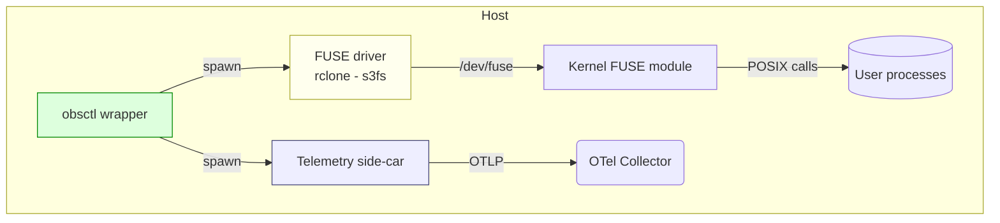
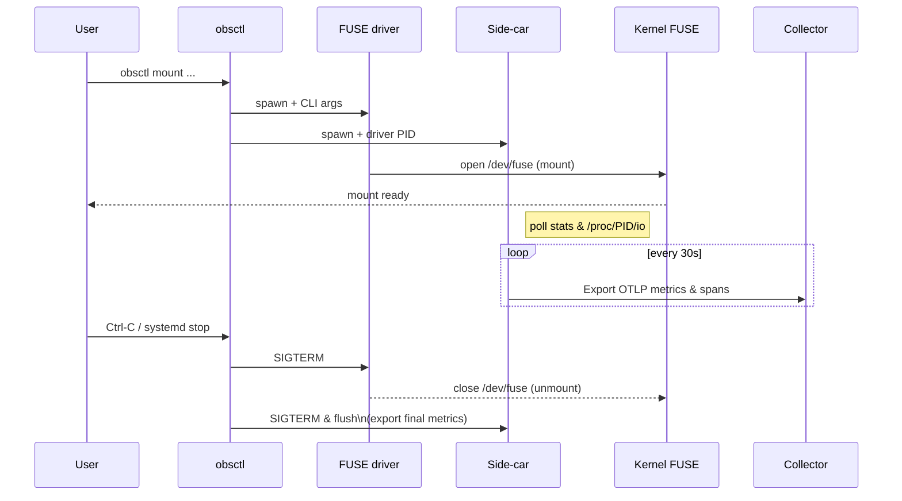

````markdown
# PRD – **`obsctl mount` wrapper with OpenTelemetry side-car**

---

## 1 — Purpose

Provide users an **easy, one-liner mount** of Cloud.ru S3 buckets *and* deliver **rich OpenTelemetry (OTel) metrics/traces** without writing a new FUSE driver.

| Attribute | Outcome |
|-----------|---------|
| **Time-to-value** | Ship in ≤ 2 sprints instead of 6–8 weeks. |
| **Safety** | Re-use proven drivers (`rclone`, `s3fs`, `goofys`) to avoid data-loss edge cases. |
| **USP**   | Automatic, zero-config OTel export: latency histos, IOPS, errors, cache hit ratio. |
| **Scope** | Linux first (systemd service), macOS optional (user FS). |

---

## 2 — Glossary

| Term | Meaning |
|------|---------|
| **FUSE driver** | Existing binary (`rclone mount`, `s3fs`, etc.) that exposes an S3 bucket as a POSIX FS. |
| **Wrapper** | New `obsctl mount` command that spawns & manages the driver. |
| **Telemetry side-car** | Lightweight Rust process reading driver stats / `/proc/<pid>/io`, converts to OTel. |
| **Service template** | `obsctl-mount@.service` & `obsctl-mount@.timer` for systemd. |

---

## 3 — Goals & Non-Goals

### 3.1 Goals

1. **Single CLI**:  
   ```bash
   obsctl mount s3://bucket /mnt/bucket --otel-endpoint http://otel:4317
````

2. **Out-of-the-box metrics** in the collector (no manual SDK code, no Prom scrape).
3. **Credential injection** (env vars, AWS profile, Cloud.ru custom endpoint).
4. **Graceful shutdown** (SIGTERM → unmount → flush → stop side-car).
5. **Systemd units** generated via `obsctl systemd install --bucket bucket …`.

### 3.2 Non-Goals

* Implementing a **native FUSE driver** (deferred).
* Perfect POSIX semantics (delegated to wrapped driver).

---

## 4 — User Stories

| ID     | Story                                                      | Acceptance criteria                                                   |
| ------ | ---------------------------------------------------------- | --------------------------------------------------------------------- |
| **U1** | *“As a data engineer, I need to mount buckets quickly.”*   | `obsctl mount …` mounts within 3 s; `ls /mnt/bucket` shows objects.   |
| **U2** | *“As a platform SRE, I need metrics in Grafana.”*          | After mount ≥1 minute, `obsctl_fs_read_bytes_total` visible via OTLP. |
| **U3** | *“As an operator, I want mounts to persist after reboot.”* | `obsctl systemd install …` creates an enabled service and timer.      |
| **U4** | *“As a security lead, I must audit credentials.”*          | No creds written to disk; wrapper passes via env or `stdin`.          |

---

## 5 — Architecture

### 5.1 Component diagram (Mermaid)



### 5.2 Sequence diagram (mount happy-path)



---

## 6 — Design Details

### 6.1 Wrapper (`obsctl mount`)

| Responsibility       | Implementation hints                                                                               |      |                             |
| -------------------- | -------------------------------------------------------------------------------------------------- | ---- | --------------------------- |
| Arg parsing          | `clap` sub-command.<br>\`--impl=\[rclone                                                           | s3fs | goofys]`(default`rclone\`). |
| Credential injection | Re-use existing obsctl config loader (AWS env, INI, Cloud.ru custom).                              |      |                             |
| Process supervision  | `tokio::process::Command` + stdout/stderr piping.<br>Restart on non-zero exit if `--auto-restart`. |      |                             |
| Health               | `sd_notify(READY=1)` after `/proc/mounts` contains path.                                           |      |                             |
| Unmount              | `fusermount3 -u <path>` or `umount -l`.                                                            |      |                             |

### 6.2 Side-car

| Source of numbers | Method                                                                   |
| ----------------- | ------------------------------------------------------------------------ |
| **rclone**        | `--stats 30s --stats-json` → every 30 s JSON line on stderr.             |
| **s3fs**          | `-o dbglevel=info -f -o curldbg` – parse “Transferred” lines (fallback). |
| **/proc/**        | Fallback per-PID I/O counters for generic drivers.                       |

> Build as a *library crate* (`obsctl_otel_exporter`) reused by other sub-commands.

### 6.3 Metrics Schema (OTLP)

| Instrument                    | Unit      | Dimensions     | Description                   |
| ----------------------------- | --------- | -------------- | ----------------------------- |
| `obsctl_fs_read_bytes_total`  | bytes     | bucket, impl   | Cumulative data read from FS. |
| `obsctl_fs_write_bytes_total` | bytes     | bucket         | …                             |
| `obsctl_fs_ops_total`         | 1         | opcode, bucket | Counter of FUSE ops.          |
| `obsctl_fs_latency_ms`        | ms (hist) | opcode, bucket | End-to-end latency.           |
| `obsctl_errors_total`         | 1         | error\_type    | Failed operations.            |

### 6.4 Systemd units generated

* **`obsctl-mount@.service`**

  ```
  ExecStart=/usr/bin/obsctl mount %i /mnt/%i --impl rclone \
      --endpoint https://obs.ru-moscow-1.hc.sbercloud.ru
  Restart=on-failure
  ```
* **`obsctl-mount@.timer`** (optional health / auto-remount every 5 min)

---

## 7 — Roadmap & Epics

| Epic                     | Description                                                      | Owner             | Estimate |
| ------------------------ | ---------------------------------------------------------------- | ----------------- | -------- |
| **E1 Wrapper CLI**       | Arg parsing, process spawn, graceful exit                        | 🟢 @dev-cli       | 4 d      |
| **E2 Side-car exporter** | Parse rclone JSON, export via OTel SDK                           | 🟢 @dev-telemetry | 5 d      |
| **E3 Systemd installer** | `obsctl systemd install` sub-cmd + unit templates                | @dev-ops          | 3 d      |
| **E4 CI & release**      | Build `obsctl` with `--feature otel`; Docker & .deb              | @dev-ci           | 2 d      |
| **E5 Docs & examples**   | README, man page, Grafana dashboard JSON                         | @tech-writer      | 2 d      |
| **E6 Validation**        | Soak test: 1 TB mixed workload, latency graphs, SIGTERM recovery | @qa               | 5 d      |

### Detailed tasks (sample for **E2**)

| #   | Task                                                  | Est   |
| --- | ----------------------------------------------------- | ----- |
| 2.1 | Add `obsctl_otel_exporter` crate: meter provider init | 1 d   |
| 2.2 | Implement rclone JSON parser – happy path             | 0.5 d |
| 2.3 | Map fields → metrics (bytes, ops, latency)            | 0.5 d |
| 2.4 | Error counters & unit tests                           | 0.5 d |
| 2.5 | Support s3fs log parsing (regex)                      | 1 d   |
| 2.6 | Docs: how to add new driver mapping                   | 0.5 d |

*(Repeat task tables for other epics as needed)*

---

## 8 — Open questions / risks

| Topic                  | Risk                                                                               | Mitigation                                               |
| ---------------------- | ---------------------------------------------------------------------------------- | -------------------------------------------------------- |
| **Driver licence**     | `s3fs` GPL-2, `rclone` MIT; mixing with our Apache-2 OK (wrapper spawns external). | Use dynamic spawn, no static linking.                    |
| **Log formats change** | Parsing may break after driver upgrade.                                            | Version pin in wrapper, CI that validates JSON scheme.   |
| **Collector overload** | Per-file spans could flood OTLP.                                                   | Only emit **metrics**; spans limited to mount lifecycle. |
| **Multiple mounts**    | Side-car per mount vs shared exporter?                                             | Start one exporter per mount (simpler first).            |

### “Can we really instrument *rclone* deeply enough?”

Short answer — **yes for 95 % of what SREs/Grafana need, but not 100 % of what a custom driver could expose.**
Below is a realistic view of *what you do get* and *where the hard limits are* when the wrapper launches `rclone mount` (or `s3fs`/`goofys`) rather than embedding our own FUSE layer.

|                                                         | What we can capture **today**                                                                                                                 | Hard / impossible without forking the driver                                               |
| ------------------------------------------------------- | --------------------------------------------------------------------------------------------------------------------------------------------- | ------------------------------------------------------------------------------------------ |
| **Bucket-level I/O** (bytes ↑/↓, object/s, error types) | `rclone`’s `--stats-one-line-json` emits totals every N seconds. Side-car converts to OTel counters/histograms.                               | n/a                                                                                        |
| **Operation latency** (GET, PUT, HEAD)                  | `--stats-one-line-json` includes per-op mean & 95-percentile; side-car drops them into `obsctl_operation_duration_ms{opcode=...}` histograms. | True *per-FUSE-op* latency (rename, open) is not exported; we only see HTTP-level latency. |
| **Cache hit / miss** (if `--vfs-cache-mode writes`)     | `--stats` shows `cache/evicted`, `cache/hits`.                                                                                                | Granular “which file missed” traces.                                                       |
| **Driver errors** (HTTP 4xx/5xx, retries)               | `--log-format json --log-level ERROR` lines → map to `error_type="http_503"` counters.                                                        | Kernel-level EIO/ENOSPC path details.                                                      |
| **Mount health** (latency spikes, stuck ops)            | Side-car can watch `/proc/<rclone>/fdinfo` + `/sys/fs/fuse/connections/*/waiting` to detect queues/back-pressure.                             | Per-thread FUSE wait times need rclone changes.                                            |
| **User attribution** (which local PID did the read)     | Not available; FUSE op→PID isn’t surfaced by rclone.                                                                                          | Requires custom driver or eBPF tracing.                                                    |

#### How the wrapper squeezes juice from existing drivers

1. **JSON stats every *N* seconds**

   ```bash
   rclone mount bucket: /mnt \
     --stats=30s \
     --stats-one-line \
     --stats-one-line-json
   ```

   Each line contains \~25 numeric fields; our side-car parses, converts and flushes to OTLP.

2. **Real-time logs**
   *Errors, retries, throttling* appear on stderr with `--log-level INFO/DEBUG`.
   Regex -> counter.

3. **Kernel observability add-ons**
   *Optional* eBPF program samples `fuse_read_iter` / `fuse_write_iter`; same exporter publishes those as advanced metrics **only if** the host supports `bpf` & we’re run as root.

4. **Rclone RC (remote control) API**
   The side-car can `curl http://localhost:5572/core/stats` for structured JSON not printed to logs; gives cumulative totals since start.

---

### What if teams need **deeper, per-object spans** next year?

* **Option A – patch upstream rclone**
  rclone is Go; we could submit a PR to add OpenTelemetry hooks.
  That gives native spans without owning FUSE logic.

* **Option B – provable kernel hooks**
  eBPF programs can attach to `fuse_*` tracepoints and emit per-op latency w/ PID, filename (kernel ≥ 5.11). Exporter already supports BPF perf-event reading.

* **Option C – long-term: native Rust FUSE backend**
  Captures everything inside one process; biggest effort but unlimited insight.

---

### Practical recommendation

| Phase          | Deliverable                             | Instrumentation quality                                 |
| -------------- | --------------------------------------- | ------------------------------------------------------- |
| **Sprint 1–2** | Wrapper + side-car + rclone JSON → OTel | \~90 % of dashboard needs (bytes, ops, latency, errors) |
| **Backlog**    | eBPF plugin (root-only)                 | + per-FUSE-op latency                                   |
| **Stretch**    | Fork rclone or build native driver      | Full trace/span fidelity                                |

That staged approach means we **ship value next month**, collect real-world feedback, and only invest in deeper plumbing if customers hit instrumentation limits.


---

## 9 — Success metrics

* **P0** Mount time < 3 s, unmount < 1 s.
* **P0** Metrics visible in collector within 60 s of mount.
* **P1** No unhandled panics / crashes in 24 h soak test.
* **P1** 99-th percentile FUSE read latency overhead < 5 ms vs bare rclone.
* **P2** Systemd watchdog exit code ≠ 0 generates OTEL error count.

---

## 10 — Appendices

### A. Example Grafana panel queries

```sql
sum by (bucket) (rate(obsctl_fs_read_bytes_total[5m]))
histogram_quantile(0.95, rate(obsctl_fs_latency_ms_bucket{opcode="read"}[5m]))
```

### B. Reference commands

```bash
# Mount with default driver (rclone)
obsctl mount s3://my-bucket /mnt/my-bucket --otel-endpoint http://otel:4317

# Same but using goofys
obsctl mount s3://my-bucket /mnt/my-bucket --impl goofys \
  -o allow_other --read-ahead 8M --dir-mode 0775
```

---

*Prepared 2025-07-03 by the obsctl team*
*(Feel free to copy into `docs/PRD_obsctl_mount.md` inside the repo.)*

```
```
